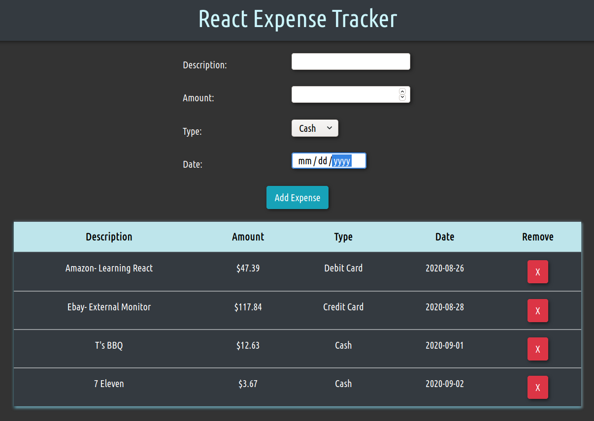

# Expense Tracker React

> Expense tracker build using React-JS and styled with Bootstrap 4

 

Check out the app [HERE](https://bb-expense-react.herokuapp.com/)

## Summary

I built this application to learn how to operate React JS. I know React is an industry standard for front end development and I know it is very important to be familiar using these tools.

I started from scratch when building this app. I learned all about how React manipulates the virtual dom to display a web application. The syntax was very different from what I have done before, but now that I am more comfortable with it I see how powerful it can be.

The specifics of what I learned are the following:

> React Components

> React Events, State, Props & Conditional Rendering

> Lifestyle Methods

> Styling React with Bootstrap 4

> Deployment to Heroku

## Author

### Brian Bastanza- Full Stack Web Developer

<a href="https://www.brianbastanza.me/" target="_blank" rel="noopener">Personal Website</a>

[LinkedIn](https://www.linkedin.com/in/bbastanza)
